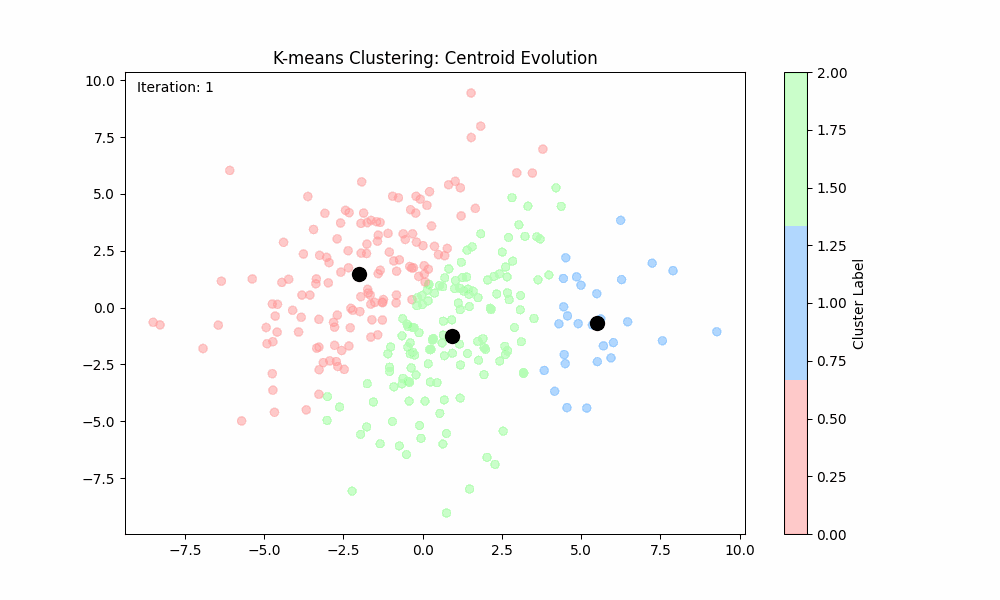
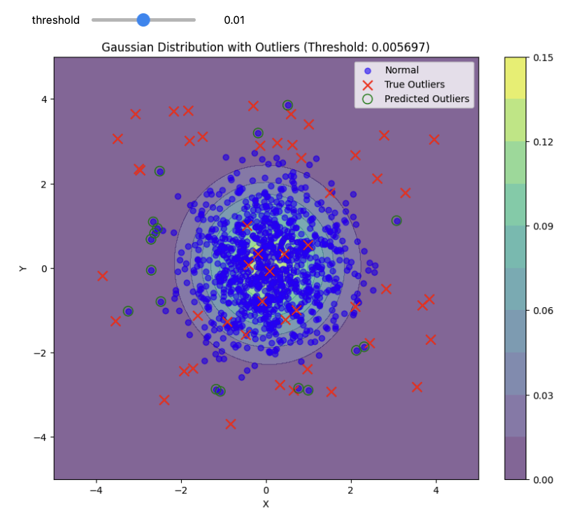

# Machine Learning Algorithms In Rust

| Algorithm | Description | Visualization |
|-----------|-------------|----------------|
| [Multi-class AdamW Logistic Regression](./logistic-regression/) | A statistical method for predicting classes |  |
| [K Means Clustering](./k-means/) | Unsupervised ml technique for partitioning data into k clusters |  |
| [Gaussian Estimation](./gaussian-estimation/) | Anomaly Detection using Multivariate Gaussian Estimation |  |

